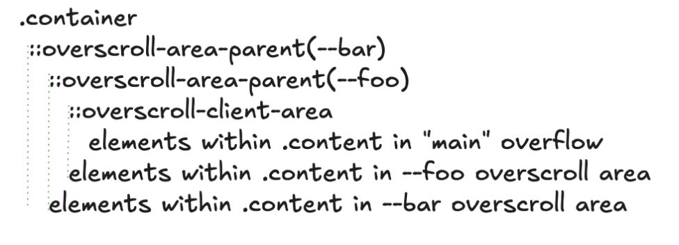

# Gestures as UI activation primitives

## Background

The web platform provides a rich set of primitives for building visually
compelling, animated experiences. One of the key features of the web platform is
to allow for animated content, which is the feature of focus in this document.
Most properties can be animated from one value to another which allows for
smooth transitions. The web has a rich set of animation capabilities such as CSS
Animations, Web Animations, and View Transitions. 

Animations typically advance with time. However, that's not the only way to
advance an animation. Recently, we've developed a Scroll Timeline to allow the
animation advance with scroll. Specifically, the progress of the animation is
tied to a scroll timeline, which advances (and reverses) with the scroll
progress. The notion of timeline was also generalized to include a document
timeline which advances with real time. This means that any animation in order
to have a visual animated effect is associated with some timeline.

What appears to be missing from the set is gesture interaction that allows
content to be moved around in response to user swiping on the screen. For
example, things like sidebar menu or pull to refresh are awkward to express
today without script. Notably, it is possibly to polyfill some of these
behaviors with Scroll Driven Animations and Snap Points, but the implementation
requires insight and an in-depth understanding of these features behave.

[Example of Scroll Driven Animation enabled sidebar menu](https://flackr.github.io/web-demos/css-scroll-snap/menu/index.html#content)

## Proposal

We propose adding a set of new simple-to-use primitives that enable rich
interactive patterns that involve moving content around, such as the case with
sidebar menus and pull-to-refresh UI.

**_Note: this is an early proposal and subject to substantial changes._**

### Overscroll areas

The idea is that each element may have one or more _overscroll_ areas which can
house elements and have their own overflow areas in addition to the element's
regular overflow.

Let's considering the following HTML snippet:

```html
<div class=container>
  ...
  <div class=e>...</div>
  ...
</div>
```

First step is to declare overscroll areas on the element:

```css
.container {
  overscroll-area: --foo;
}
```

Now, we can add elements into this overflow by declaring which overscroll areas
they would like to reside in.

```css
.e {
  overscroll-position: --foo;
}
```

Now _e_ is in the overscroll area of _container_.

### What does this mean?

When this is configured, we can use _internal_ (non-developer exposed) pseudo
elements to construct the following box structure:

<p align="center">
  
</p>

Here, .container has one child: overscroll-area-parent(--foo), which contains
::overscroll-client-area and the children that are located in this overscroll
area. The client area, in turn, contains the children that are not in the
overflow area (ie regular "main" overflow children).

This structure provides some natural behaviors:
* Hit testing will begin from the element's box decorations object. Then it will
  recurse into ::overscroll-area-parent, and then try to hit test the overscroll
  elements first that are visually on top.. If it doesn't find a target, it will
  recurse into ::overscroll-client-area and ultimately down to the main overflow
  area of the scroller.
* Scroll chaining will start from the inner most element (for example). When
  that scrolling content is at the end, it will naturally chain from
  ::overscroll-client-area to ::overscroll-area-parent allowing overscroll. Then it
  will continue chaining past .container (since it has effective overscroll:
  clip) and up the regular scrolling chain.

This means that when we scroll, we first scroll the main scrollable area, but
when we reach the end. We can start a new scroll in the same direction and if
there's an element in that direction, we would scroll that into view.

<p align="center">
  
</p>

([simple polyfill on codepen](https://codepen.io/Vladimir-Levin-the-flexboxer/pen/wBMavyM))

Note for completeness, `overscroll-area` should be able to take a list of dashed
idents to support multiple areas.

```css
.container {
    overscroll-area: --foo, --bar
}
```

The above would generate the following structure:

<p align="center">
  
</p>

### Overlay

Note that would also support `overlay` mode where the overscrolling content does
not move the main overscroll area. This would be accomplished similar to
position sticky on the main overscroll area.

```css
.container {
    overscroll-area: --foo overlay;
}
```

_TODO: Add examples_

### Events

In order to allow developers to react to these changes several events can be
added as well.

`overscrollgesturestart`: emitted when an overscroll gesture is started on _container_
in a direction that would reveal one or more of its attached elements (e.g.
_e_).

`overscrollgesturechanging`: emitted during a gesture if current progress of
the gesture would change its state. Simipar to `scrollsnapchanging` for scroll
snap points and is emitted as similar timing.

`overscrollgestureend`: emitted when the gesture resulted in a changed state
after all of the scrolling animations have finished.

`overscrollgesturecancel`: emitted when the gesture did not result in a changed
state after all of the scrolling animations have finished.

### Discussion and Open Questions

_If you have a comment or question, please file an issue in this repository with
the title prefix "Gestures: "_

#### Position side-effects

`overscroll-position` could be a new `position` value, since we would want this
element to be out of flow positioned always, so it doesn't make sense to support
in-flow `position` values if we have `overscroll-position`.

#### Accessibility

Since this ultimately hides the element until a overscroll swipe reveals it,
default accessibility treatment is important to ensure that assistive technology
users can access the content without the need to swipe.

We likely want to support keyboard and other methods of scrolling which would
allow accessing these areas.

## TODOs

* We need to flesh out the default accessibility treatments, as well as which
  customizations are necessary
* We need to explain the implementation model


