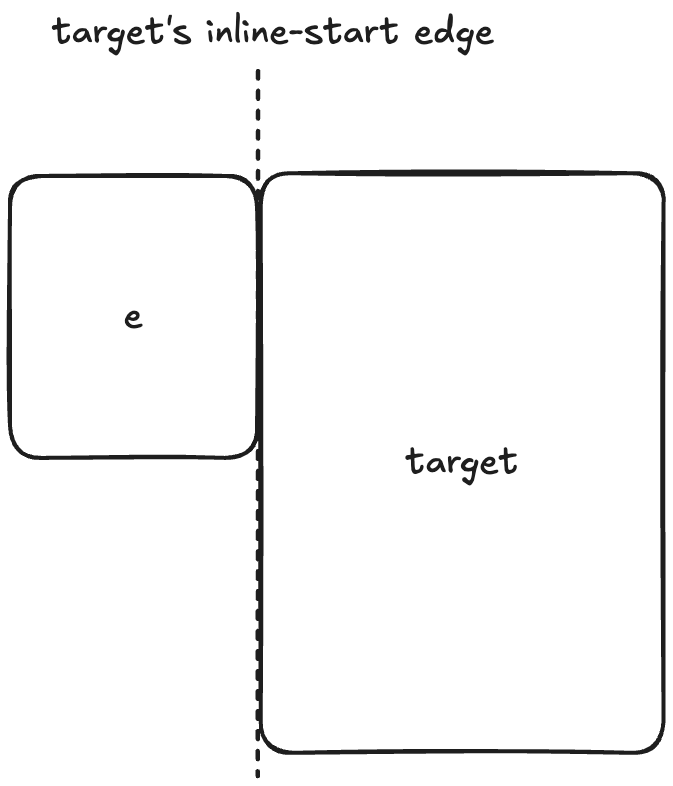
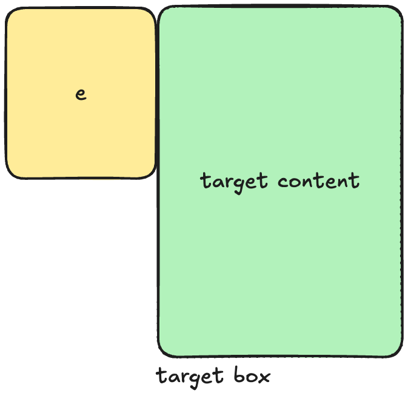
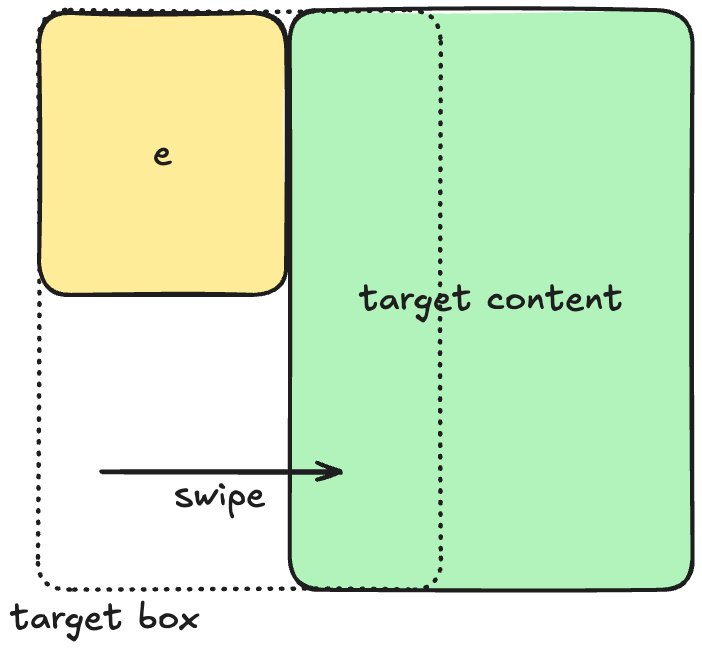
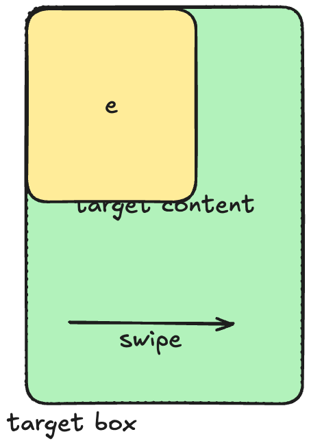
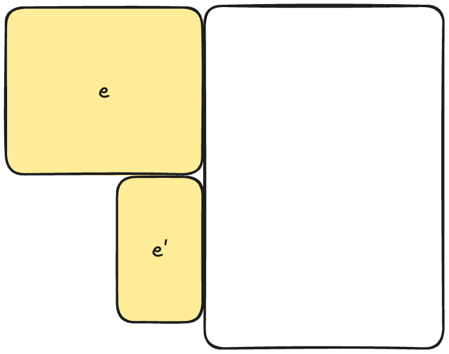
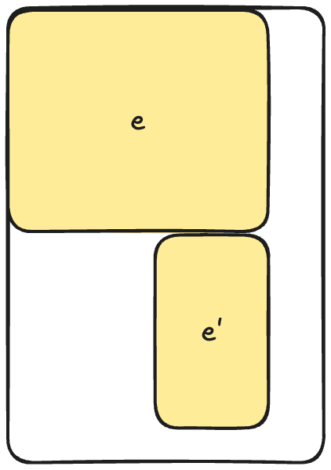
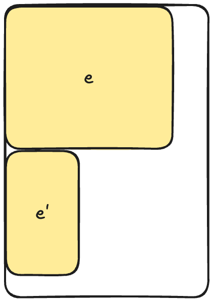

# Gestures as UI activation primitives

## Background

The web platform provides a rich set of primitives for building visually
compelling, animated experiences. One of the key features of the web platform is
to allow for animated content, which is the feature of focus in this document.
Most properties can be animated from one value to another which allows for
smooth transitions. The web has a rich set of animation capabilities such as CSS
Animations, Web Animations, and View Transitions. 

Animations typically advance with time. However, that's not the only way to
advance an animation. Recently, we've developed a Scroll Timeline to allow the
animation advance with scroll. Specifically, the progress of the animation is
tied to a scroll timeline, which advances (and reverses) with the scroll
progress. The notion of timeline was also generalized to include a document
timeline which advances with real time. This means that any animation in order
to have a visual animated effect is associated with some timeline.

What appears to be missing from the set is gesture interaction that allows
content to be moved around in response to user swiping on the screen. For
example, things like sidebar menu or pull to refresh are awkward to express
today without script. Notably, it is possibly to polyfill some of these
behaviors with Scroll Driven Animations and Snap Points, but the implementation
requires insight and an in-depth understanding of these features behave.

[Example of Scroll Driven Animation enabled sidebar menu](https://flackr.github.io/web-demos/css-scroll-snap/menu/index.html#content)

## Proposal

We propose adding a set of new simple-to-use primitives that enable rich
interactive patterns that involve moving content around, such as the case with
sidebar menus and pull-to-refresh UI.

**_Note: this is an early proposal and subject to substantial changes._**

### Overscroll anchor

The idea is to think about the element _e_ as being attached to the overscroll
region of another element _target_.

First step is to declare a name for _target_, which makes it a valid target for
attachment:

```css
.target {
  overscroll-anchor: --target;
}
```

Now, we can attach other elements such as _e_ to this target by referring to its
`overscroll-anchor` name:

```css
.e {
  position: overscroll-anchor(--target, inline-start);
}
```

Here, _e_ is attached to the `inline-start` edge of _target_. This means that it
is off to the `inline-start` direction, located across the edge from the content
of _target_:



Now, if we are at the end of the `inline` scroll in the direction in which _e_
is attached, we allow to overscroll in that direction revealing _e_. For
example, let's start with the following set up:



Then we can do a swipe to reveal _e_:



Internally, this is accomplished by placing the contents of _target_ and _e_
within an unexposed scroller, so all of the scrolling physics apply.

Note that we also add sufficient scroll snap point information so that the
scroller has two stable states: either _e_ is fully visible or fully hidden.

We can also allow _e_ to overlay _target_'s content for a different effect:

```css
.e {
  position: overscroll-anchor(--target, inline-start overlay);
}
```



### Events

In order to allow developers to react to these changes several events can be
added as well.

`overscrollgesturestart`: emitted when an overscroll gesture is started on _target_
in a direction that would reveal one or more of its attached elements (e.g.
_e_).

`overscrollgesturechanging`: emitted during a gesture if current progress of
the gesture would change its state. Simipar to `scrollsnapchanging` for scroll
snap points and is emitted as similar timing.

`overscrollgestureend`: emitted when the gesture resulted in a changed state
after all of the scrolling animations have finished.

`overscrollgesturecancel`: emitted when the gesture did not result in a changed
state after all of the scrolling animations have finished.

### Discussion and Open Questions

_If you have a comment or question, please file an issue in this repository with
the title prefix "Gestures: "_

#### Position side-effects

Since we use the `position` property, we need to figure out how the attached
element _e_ is laid out.

A natural proposal is to treat the attached location as the "natural layout
position" of _e_, and otherwise treat the position as `absolute`.

Alternatively, a more expressive syntax can be developed such as the following:

```css
position: absloute overscroll-anchor(--target, inline-start)
```

or

```css
position: fixed overscroll-anchor(--target, block-end)
```

#### Multiple attachments

If multiple elements are attached to the same edge, there is an open question to
how far the gesture extends and what is the effect.

The two competing options is to treat the smaller element as sticking to the
edge or to continue moving until the larger element is fully visible.

For example, consider the following situation:



Now consider what happens when we complete the gesture.

Option 1: everything moves in sync as far as the widest element:



Option 2: the smaller element sticks to the edge when it would scroll too far:



#### Accessibility

Since this ultimately hides the element until a overscroll swipe reveals it,
default accessibility treatment is important to ensure that assistive technology
users can access the content without the need to swipe.

One of the possible approach is to allow the _edge_ which is a target of
attachment to become focusable. This can be done by introducing a new
pseudo-element such as `::overscroll-edge(inline-start)` which can be focused
and activated. By activating this edge, it would cause the same effect as
swiping the content into view. 

Another non-competing possibility is to allow keyboard scrolling to reveal
overscroll after say two scrolls in the direction that has attached content.

## TODOs

* We need to flesh out the default accessibility treatments, as well as which
  customizations are necessary
* We need to explain the implementation model


