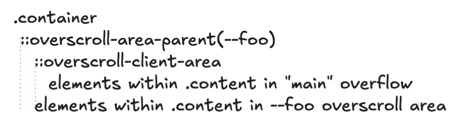
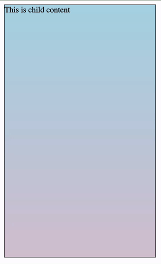

# Gestures as UI activation primitives

## Background

The web platform provides a rich set of primitives for building visually
compelling, sophisticated experiences. Frequently, the necessary primitives for
building an experience are available but need to be composed in non-trivial ways
to accomplish an effect. 

One such example is an experience of building a side menu. Although it is simple
to construct a menu, it isn't easy to make the menu appear and hide as needed.
This can be built using nested scrollers. Managing positioning and interactions
with nested scrollers is complex. Additionally, it is easy to forget
accessibility implications for users that rely on scrolling affordances other
than touch and mouse. 

Relying on scrolling also provides access to animation primitives such as a
scroll timeline, enabling sophisticated experiences.

[Example of Scroll Driven Animation enabled sidebar menu](https://flackr.github.io/web-demos/css-scroll-snap/menu/index.html#content)

This document explores a proposal to make building nested scroller-like
experiences easy, strongly encouraging accessible affordances to access the
scrollable areas.

## Terminology

Scrollable area: an area that is accessible to the user using a scroll gesture.
Typically this area also automatically scrolls content into view in responce to
focus navigation, find-in-page, and similar features. 

Scroll chaining: a notion that when an element is scrolled that does not have
available scroll area, the scroll continues in the next ancestor scroller.

Overscroll: a notion of continuing a scroll gesture in a direction where there
is no longer scrollable content available. Typically, overscroll chains the
scroll to the ancestor scroller.

## Goals

This proposal explores defining semantic relationships between an element and
its overscroll area. Specifically, this allows an easy construction of elements
with overscroll areas that themselves contain other content.

## Non-Goals

This proposal does *not* introduce any general purpose gesture recognition APIs.
It instead focuses on scrolling as a fundamental existing behavior and extends
it to overscroll areas.

## Proposal

We propose adding a set of HTML attributes that allow the author to _bind_ one
element to another via a focusable, activatable element such as a button. When
bound, the element's box will be positioned within the overscroll area of the
second element. Furthermore, the activatable element, such as a button, serves
as a way to access the overscroll area without requiring a scroll action.

**_Note: this is an early proposal and subject to substantial changes._**

### Overscroll area binding

To bind an element into an overscroll area of another, we propose new attributes
that are only valid on activatable elements such as buttons and links:

```html
<div id="container">
    ...
    <button overscrollcontent="#menu" overscrollfor="#container">Menu</button>
    ...
    <menu id="menu">
      ...
    </menu>
    ...
</div>
```

This accomplishes a few things:
* `#menu` becomes an absolutely positioned element, whose box is conceptually
  placed in an overscroll area of `#container`. 
* `#menu` can now be placed, potentially with inset properties or anchor
  positioning, anywhere relative to the `#container`. 
* When `#container`'s scrollable content is at the end, if that direction
  contains (a portion) of the `#menu`, the scroll chains to this overscroll area
  allowing the `#menu` to be brought on screen.
* `<button>` itself when activated scrolls the `#menu` into view, similar to a
  `scrollIntoView()` call.

### Events

Note to further customize experiences and allow more effects, we need to expose
events that notify script when these overscroll areas are interacted with:
start, overscrolled, canceled, etc.

The details of the events is not explored in this document, since it depends on
developer need. However, below we describe an example set:

`overscrollgesturestart`: emitted when an overscroll gesture is started on _container_
in a direction that would reveal one or more of its attached elements (e.g.
_e_).

`overscrollgesturechanging`: emitted during a gesture if current progress of
the gesture would change its state. Simipar to `scrollsnapchanging` for scroll
snap points and is emitted as similar timing.

`overscrollgestureend`: emitted when the gesture resulted in a changed state
after all of the scrolling animations have finished.

`overscrollgesturecancel`: emitted when the gesture did not result in a changed
state after all of the scrolling animations have finished.


### Snap points

Another qualify of life improvement that we propose is setting scroll snap
points at points that allow fully overscrolled content to be snapped, as well as
fully not-overscrolled. 

### What does this all mean?

_TODO: We need to update the diagrams with the HTML proposal. Largely the pseudo
elements would remain the same, but the naming will be unexposed tokens that
uniquely identify area to element mapping._

When this is configured, as an example, we can use _internal_ (non-developer
exposed) pseudo elements to construct the following box structure:

<p align="center">
  
</p>

Here, .container has one child: overscroll-area-parent(--foo), which contains
::overscroll-client-area and the children that are located in this overscroll
area. The client area, in turn, contains the children that are not in the
overflow area (ie regular "main" overflow children).

This structure provides some natural behaviors:
* Hit testing will begin from the element's box decorations object. Then it will
  recurse into ::overscroll-area-parent, and then try to hit test the overscroll
  elements first that are visually on top.. If it doesn't find a target, it will
  recurse into ::overscroll-client-area and ultimately down to the main overflow
  area of the scroller.
* Scroll chaining will start from the inner most element (for example). When
  that scrolling content is at the end, it will naturally chain from
  ::overscroll-client-area to ::overscroll-area-parent allowing overscroll. Then it
  will continue chaining past .container (since it has effective overscroll:
  clip) and up the regular scrolling chain.

This means that when we scroll, we first scroll the main scrollable area, but
when we reach the end. We can start a new scroll in the same direction and if
there's an element in that direction, we would scroll that into view.

<p align="center">
  
</p>

([simple polyfill on codepen](https://codepen.io/Vladimir-Levin-the-flexboxer/pen/wBMavyM))

### Overlay

Note that would also support `overlay` mode where the overscrolling content does
not move the main overscroll area. This would be accomplished similar to
position sticky on the main overscroll area.

```html
<button overscrollcontent="#menu" overscrollfor="#container" overscrollmode="overlay">
</button>
```

### Discussion and Open Questions

_If you have a comment or question, please file an issue in this repository with
the title prefix "Gestures: "_

#### Accessibility

Since this ultimately hides the element until a overscroll swipe reveals it,
default accessibility treatment is important to ensure that assistive technology
users can access the content without the need to swipe.

This is a fundamental reason why the binding of an element to its overscroll
container is done via an activatable element. This strongly encourages an
existence of an element that is capable of bringing this area into view without
requiring scroll gestures. Note that other than providing the binding, this
element remains a regular activatable element that can be styled and placed as
necessary. Activating this element would scroll the overscroll area into view
and send the appropriate events to indicate that this area was activated. This
enables a number of patterns to be accomplished in a way that remains accessible
to, for example, keyboard users.

## Alternatives explored

### CSS

We have considered making these bindings in CSS, which would allow a similar
treatment to a set of elements leveraging the power of CSS selectors. For
example, a swipe to dismiss list needs each list item to be configured with an
overscroll area. This can be cumbersome in HTML.

However, due to semantic nature of these relationships, coupled with the fact
that it isn't trivial to strongly encourage an element like a button, we've
decided that this feature would be best suited for HTML.


